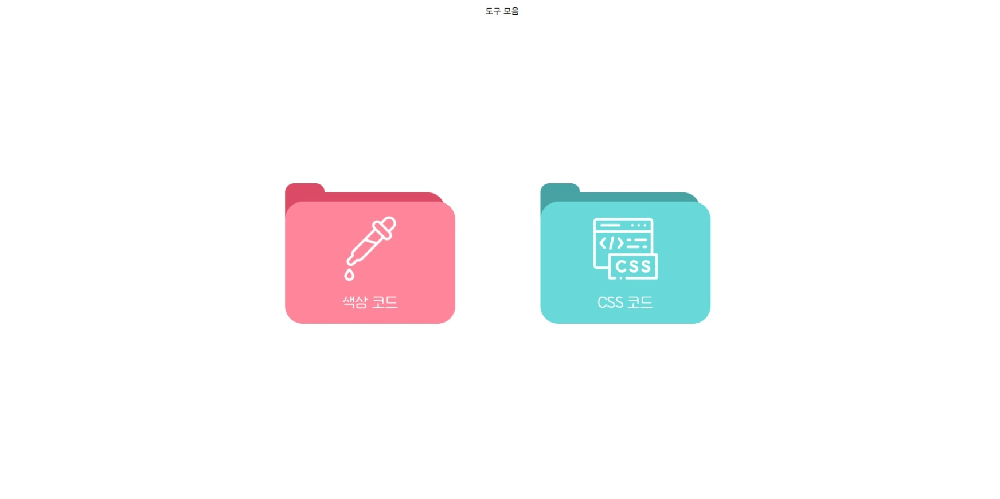
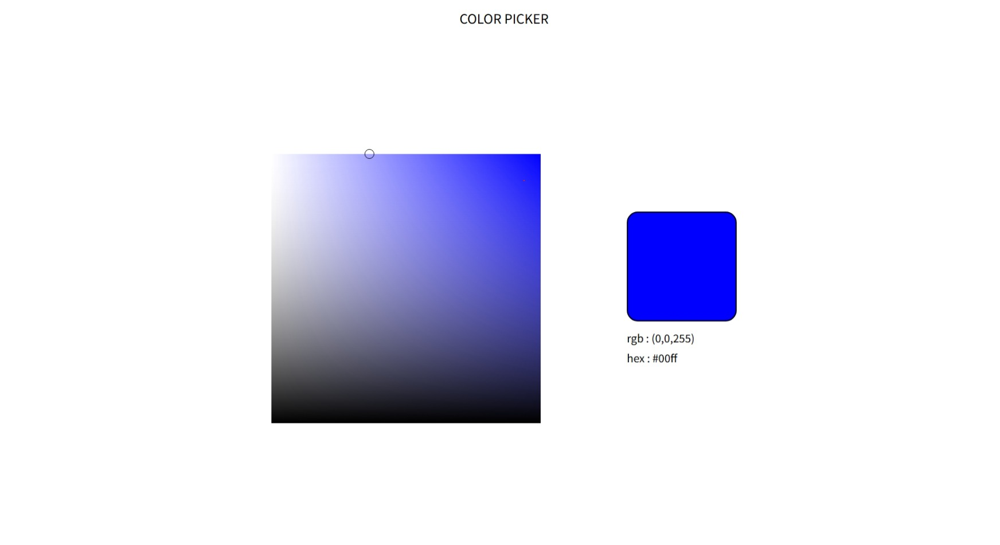

# project-eight

도구 모음 사이트 제작.

- [구현] 색상 코드 변환 : 컬러파레트, 색상코드, CMYK, RGB / 복사 가능.

- [미구현] css 디자인 라이브러리 : 내부 네비게이션으로 분류, 클릭 시 css 복사 가능.

## 구현

도구 모음의 메인 페이지. 폴더 느낌으로 색상 코드 도구와 css 코드 도구 페이지로 이동할 수 있는 링크를 삽입하였다.

색상의 rgb 코드와 hex 코드를 산출하는 도구이다. 왼쪽의 팔레트에서 색을 지정할 수 있으며 팔레트를 클릭할 경우 원 모양으로 클릭한 구역을 표시해 준다. 오른쪽 부분에는 선택한 색상과 그 색상의 rgb 코드, hex 코드 값을 보여준다.

가로로 흰색, 파란색 gradient를 추가한 뒤 세로로 명도 조절을 위한 검은색 gradient를 추가하여 팔레트를 제작하였다. 이를 통해 오른쪽에서 왼쪽으로 갈 수록 채도가 옅어지고 위쪽에서 아래쪽으로 갈수록 명도가 진해지는 팔레트를 구성하였다.
